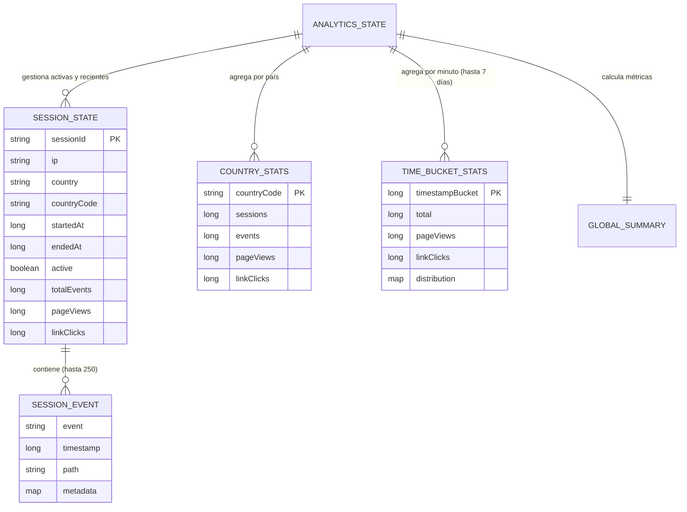

# Especificación de Datos y Analíticas (`docs/ANALITICAS.md`)

Este documento describe exhaustivamente qué información se captura, cómo se procesa, qué métricas se computan y cómo se almacena y transmite la información de analíticas en el backend.

---

## 1. Modelo de Datos de Analíticas

El sistema estructura las analíticas en torno a **Sesiones**, **Eventos de Sesión**, **Métricas Agregadas Globales**, **Estadísticas Geográficas** y **Series Temporales**.



---

## 2. Detalle de los Datos Almacenados

### 2.1. Sesión de Usuario (`SessionState`)
Representa una conexión continua de un visitante en el sitio web:

| Campo | Tipo | Descripción | Ejemplo / Valores |
| :--- | :--- | :--- | :--- |
| `sessionId` | `String` | Identificador único de la conexión WebSocket. | `"ws-session-uuid-1234"` |
| `ip` | `String` | Dirección IP pública resuelta del cliente (`X-Forwarded-For` o socket). | `"88.12.34.56"` |
| `country` | `String` | Nombre completo del país resuelto mediante GeoIP2. | `"Spain"`, `"United States"` |
| `countryCode` | `String` | Código ISO de 2 letras del país. | `"ES"`, `"US"` |
| `startedAt` | `long` | Timestamp Unix (en segundos) de inicio de la sesión. | `1771780000` |
| `endedAt` | `Long` | Timestamp Unix de desconexión (`null` si sigue activa). | `1771780350` |
| `active` | `boolean` | `true` si la conexión WebSocket está abierta; `false` si terminó. | `true` / `false` |
| `totalEvents` | `long` | Contador acumulado de todos los eventos disparados en la sesión. | `14` |
| `pageViews` | `long` | Contador acumulado de vistas de página en esta sesión. | `3` |
| `linkClicks` | `long` | Contador acumulado de clics en enlaces en esta sesión. | `8` |
| `events` | `Deque<SessionEvent>` | Lista cronológica inversa con los últimos eventos (hasta 250). | `[...]` |

---

### 2.2. Eventos Individuales (`AnalyticsEvent` & `SessionEvent`)
Cada acción realizada por un visitante genera un registro de evento con los siguientes atributos:

| Campo | Tipo | Descripción | Ejemplo |
| :--- | :--- | :--- | :--- |
| `sessionId` | `String` | ID de la sesión que originó el evento. | `"ws-session-uuid-1234"` |
| `eventType` / `event` | `String` | Nombre o tipo de la acción efectuada. | `"SESSION_START"`, `"SESSION_END"`, `"PAGE_VIEW"`, `"LINK_CLICK"` |
| `path` | `String` | Ruta relativa o URL donde ocurrió la acción. | `"/"`, `"/projects"`, `"/contact"` |
| `timestamp` | `long` | Timestamp Unix en segundos en el momento del evento. | `1771780120` |
| `country` | `String` | País del visitante asociado al evento. | `"Spain"` |
| `countryCode` | `String` | Código de país ISO. | `"ES"` |
| `ip` | `String` | Dirección IP del usuario. | `"88.12.34.56"` |
| `metadata` | `Map<String, String>` | Parámetros adicionales dinámicos enviados por el cliente. | `{"targetUrl": "https://github.com", "elementId": "btn-github"}` |

#### Eventos Estándar del Sistema:
1. **`SESSION_START`**: Registrado automáticamente cuando el cliente establece conexión WebSocket.
2. **`SESSION_END`**: Registrado cuando el cliente cierra la conexión o expira el socket.
3. **`PAGE_VIEW`**: Enviado por el frontend al cargar o navegar a una ruta (`path`). Incrementa contadores de `pageViews` e impacta en el ranking de `topPaths`.
4. **`LINK_CLICK`**: Disparado al hacer clic en enlaces o botones interactivos.
5. **Eventos Personalizados**: Cualquier acción arbitraria enviada en el payload (ej. interacción con componentes, formularios, etc.).

---

### 2.3. Resumen Global de Métricas (`Summary`)
Métricas computadas en tiempo real para el panel de administración:

| Métrica | Cálculo / Origen | Significado |
| :--- | :--- | :--- |
| `activeSessions` | `activeSessions.size()` | Visitantes navegando activamente en este instante. |
| `totalSessions` | Contador acumulativo histórico | Total de sesiones iniciadas registradas. |
| `totalEvents` | Contador acumulativo histórico | Total de eventos procesados. |
| `pageViews` | Contador de eventos `PAGE_VIEW` | Total de páginas visualizadas históricamente. |
| `linkClicks` | Contador de eventos `LINK_CLICK` | Total de clics registrados históricamente. |
| `avgSessionDuration` | $\frac{\sum \text{duración}(S)}{\text{total sesiones conocidas}}$ | Duración promedio por sesión (en segundos). |
| `countriesCount` | `countryStats.size()` | Cantidad de países únicos que han visitado el sitio. |

---

### 2.4. Ranking de Rutas (`topPaths`)
- Estructura: `Map<String, Long>`
- Mapea cada `path` visitado con el número total de visualizaciones recibidas.
- **Ejemplo**:
  ```json
  [
    { "path": "/", "views": 1540 },
    { "path": "/projects", "views": 820 },
    { "path": "/about", "views": 410 }
  ]
  ```

---

### 2.5. Distribución de Eventos (`eventDistribution`)
- Estructura: `Map<String, Long>`
- Conteo global de frecuencia agrupado por cada tipo de evento recibido.
- **Ejemplo**:
  ```json
  [
    { "event": "PAGE_VIEW", "count": 2770 },
    { "event": "LINK_CLICK", "count": 1250 },
    { "event": "SESSION_START", "count": 1100 },
    { "event": "SESSION_END", "count": 1050 }
  ]
  ```

---

### 2.6. Estadísticas Geográficas (`CountryStats`)
Agrupación de comportamiento por país (`countryCode`):

| Campo | Tipo | Descripción |
| :--- | :--- | :--- |
| `country` | `String` | Nombre del país legible (ej. `"Spain"`). |
| `countryCode` | `String` | Código ISO de 2 letras (ej. `"ES"`). |
| `sessions` | `long` | Número de sesiones iniciadas desde este país. |
| `events` | `long` | Total de eventos generados por usuarios de este país. |
| `pageViews` | `long` | Total de visualizaciones de páginas desde este país. |
| `linkClicks` | `long` | Total de clics registrados desde este país. |

---

### 2.7. Series Temporales (`TimeBucketStats`)
- **Granularidad Base**: Bloques de tiempo (*buckets*) de **60 segundos** (1 minuto).
- **Retención**: Hasta 10.080 buckets (equivalente a 7 días continuos en memoria).
- **Estructura por Bucket**:
  - `ts`: Timestamp de inicio del minuto (múltiplo de 60).
  - `total`: Total de eventos ocurridos en ese minuto.
  - `pageViews`: Vistas de página en ese minuto.
  - `linkClicks`: Clics en ese minuto.
  - `distribution`: Mapa con el desglose de cada tipo de evento ocurrido en el bucket.
- **Agregación Bajo Demanda**: El servicio de consulta (`AnalyticsQueryService`) permite remuestrear las series a intervalos de:
  - `1m` (por defecto)
  - `5m` (300 s)
  - `15m` (900 s)
  - `30m` (1800 s)
  - `1h` o `hour` (3600 s)
  - `1d` o `day` (86400 s)

---

## 3. Límites, Políticas de Memoria y Rate Limiting

Para garantizar alto rendimiento y evitar agotamiento de memoria, el backend aplica las siguientes restricciones:

| Parámetro | Límite / Configuración | Propósito |
| :--- | :--- | :--- |
| **Sesiones Recientes en RAM** | `MAX_RECENT_SESSIONS = 10,000` | Mantiene en memoria las últimas 10k sesiones cerradas. |
| **Eventos por Sesión** | `MAX_EVENTS_PER_SESSION = 250` | Buffer circular (`Deque`) por sesión para evitar que sesiones largas saturen memoria. |
| **Retención de Buckets Temporales** | `MAX_BUCKETS = 10,080` | Máximo 7 días de datos por minuto en memoria RAM. |
| **Cola de Persistencia WAL** | `MAX_QUEUE = 50,000` | Buffer de eventos en memoria antes de escribir en disco. |
| **Rate Limit por Tipo de Evento** | `RATE_LIMIT_MS = 1,000 ms` | Evita spam: un mismo tipo de evento no se procesa más de una vez por segundo por sesión. |

---

## 4. Persistencia en Disco y Recuperación

El sistema utiliza un esquema de persistencia híbrido de alta durabilidad:

```mermaid
flowchart LR
    E[Evento Ingestado] -->|enqueueEvent| Q[BlockingQueue WAL en RAM]
    Q -->|Thread WAL Writer| WAL[(analytics-wal.log)]
    
    ST[AnalyticsState en Memoria] -.->|Cada 10 seg (flushSnapshot)| TMP[analytics-snapshot.json.tmp]
    TMP -->|Atomic Move| SNAP[(analytics-snapshot.json)]
    SNAP -.->|Trunca| WAL

    subgraph Recuperación en Arranque
        SNAP -->|1. Importa Snapshot| RESTORE[AnalyticsState Restaurado]
        WAL -->|2. Reproduce Líneas Pendientes| RESTORE
    end
```

1. **`analytics-wal.log` (Write-Ahead Log)**:
   - Cada evento se serializa en JSON (una línea por evento) y se añade de forma asíncrona pero ininterrumpida.
2. **`analytics-snapshot.json` (Snapshot Periódico)**:
   - Cada 10 segundos, se exporta el estado completo en memoria a un archivo temporal (`.tmp`) y se mueve atómicamente reemplazando el snapshot principal.
   - Inmediatamente después, el archivo WAL se trunca a 0 bytes.
3. **Mecanismo de Recuperación (`recover`)**:
   - Al iniciar el servidor, primero se lee e importa el último snapshot JSON consolidado.
   - A continuación, se leen y ejecutan en orden los eventos del archivo WAL que se registraron entre el último snapshot y el apagado/caída del servidor.

---

## 5. Estructura del Snapshot Completo en Tiempo Real

Cuando un administrador autenticado se conecta o solicita el estado completo (`analytics_full_snapshot`), recibe un JSON con la siguiente estructura:

```json
{
  "version": 1,
  "generatedAt": 1771780500,
  "filters": {
    "from": null,
    "to": null,
    "countryCode": null
  },
  "summary": {
    "activeSessions": 4,
    "totalSessions": 1250,
    "totalEvents": 8430,
    "pageViews": 3120,
    "linkClicks": 1450,
    "avgSessionDuration": 185,
    "countriesCount": 18
  },
  "sessions": {
    "items": [
      {
        "sessionId": "b8a9c1d2-...",
        "ip": "88.12.34.56",
        "country": "Spain",
        "countryCode": "ES",
        "startedAt": 1771780100,
        "endedAt": null,
        "durationSeconds": 400,
        "status": "active",
        "events": 6,
        "pageViews": 2,
        "linkClicks": 3,
        "countryName": "Spain",
        "eventsDetail": [
          {
            "event": "PAGE_VIEW",
            "timestamp": 1771780105,
            "path": "/",
            "metadata": {}
          },
          {
            "event": "LINK_CLICK",
            "timestamp": 1771780150,
            "path": "/",
            "metadata": { "target": "github" }
          }
        ],
        "active": true
      }
    ],
    "page": 1,
    "pageSize": 20,
    "total": 1250
  },
  "timeseries": {
    "points": [
      {
        "ts": 1771776000,
        "pageViews": 45,
        "linkClicks": 20,
        "total": 70
      }
    ]
  },
  "topPaths": {
    "items": [
      { "path": "/", "views": 1850 },
      { "path": "/projects", "views": 940 }
    ]
  },
  "eventDistribution": {
    "items": [
      { "event": "PAGE_VIEW", "count": 3120 },
      { "event": "LINK_CLICK", "count": 1450 }
    ]
  },
  "geoCountries": {
    "items": [
      {
        "country": "Spain",
        "countryCode": "ES",
        "sessions": 850,
        "events": 5600,
        "pageViews": 2100,
        "linkClicks": 1100
      }
    ]
  },
  "activeSessions": {
    "activeSessions": 4,
    "timestamp": 1771780500
  }
}
```

---

## 6. Notificaciones en Tiempo Real (Deltas)

Mientras el panel de administración está conectado, el backend envía eventos reactivos individuales a través del canal `delta`:

### Delta de Estado de Sesión (`SESSION_STATUS`)
```json
{
  "type": "SESSION_STATUS",
  "sessionId": "b8a9c1d2-...",
  "status": "active", // o "ended"
  "timestamp": 1771780505
}
```

### Delta de Evento Disparado (`EVENT`)
```json
{
  "type": "EVENT",
  "sessionId": "b8a9c1d2-...",
  "event": "PAGE_VIEW",
  "payload": {
    "action": "PAGE_VIEW",
    "path": "/projects"
  },
  "timestamp": 1771780510
}
```
