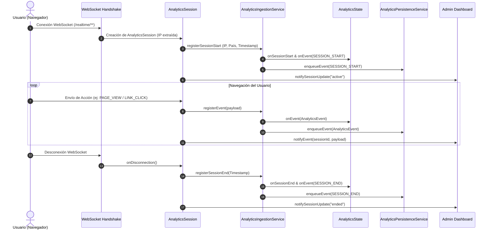

# Documentación General del Backend (`imsergioh-me-analytics-backend`)

## 1. Visión General del Proyecto

`imsergioh-me-analytics-backend` es un servicio backend desarrollado en **Java 17** y **Spring Boot 3.3.5** diseñado específicamente para dar soporte a la plataforma web personal (`imsergioh.me`). 

El backend cumple dos propósitos esenciales:
1. **Motor de Analíticas Web en Tiempo Real**: Ingesta, procesa, agrega y persiste eventos de navegación y comportamiento de usuarios en vivo mediante WebSockets, permitiendo la supervisión interactiva desde un panel de administración.
2. **Servidor CDN y Gestión de Archivos Estáticos**: Proporciona endpoints REST protegidos para la subida, listado y eliminación de archivos multimedia y recursos estáticos.

---

## 2. Pila Tecnológica (Tech Stack)

| Componente | Tecnología | Versión / Detalle |
| :--- | :--- | :--- |
| **Lenguaje** | Java | OpenJDK 17 |
| **Framework Base** | Spring Boot | 3.3.5 (Spring MVC, WebSockets, Scheduling) |
| **Framework Realtime** | LiveState Server | `me.imsergioh.livestate.core:livestate-server:1.0-SNAPSHOT` |
| **Geolocalización IP** | MaxMind GeoIP2 | 4.2.1 (`GeoLite2-Country.mmdb`) |
| **Base de Datos / Cache** | Redis | Jedis 5.1.0 (Pool de conexiones y Pub/Sub) |
| **Seguridad y Tokens** | JJWT & HMAC-SHA256 | Tokens firmados criptográficamente |
| **Serialización JSON** | Google Gson | 2.11.0 |
| **Productividad** | Lombok | Anotaciones `@Getter`, `@Setter`, etc. |
| **Gestor de Construcción**| Gradle (Kotlin DSL) | `build.gradle.kts` |

---

## 3. Arquitectura del Sistema

El backend combina una arquitectura orientada a eventos en tiempo real sobre WebSockets con una API REST ligera para la administración de archivos.

```mermaid
flowchart TD
    subgraph Clientes
        U[Visitantes Web / Clientes]
        A[Panel de Administración]
    end

    subgraph Backend Spring Boot
        subgraph Capa WebSocket [/realtime/**]
            WS[WebSocket Handler: ClientsManager]
            IP_INT[ClientIpHandshakeInterceptor]
            CAM[ClientActionsManager]
            
            subgraph Acciones Registradas
                ACT_PV[PageViewAction]
                ACT_LC[LinkClickAction]
                ACT_SA[SubAdminAction]
                ACT_SP[SetSessionsPageAction]
                ACT_DS[DeleteSessionAction]
            end
        end

        subgraph Capa REST API [/api/cdn/**]
            CDN_C[CdnController]
            AUTH_INT[AdminTokenInterceptor]
            CDN_S[CdnService]
        end

        subgraph Núcleo de Analíticas
            AIS[AnalyticsIngestionService]
            AST[AnalyticsState - En Memoria]
            AQS[AnalyticsQueryService]
            ARS[AnalyticsRealtimeService]
            GEO[DataUtil / MaxMind GeoIP2]
        end

        subgraph Capa de Persistencia
            APS[AnalyticsPersistenceService]
            WAL[(WAL: analytics-wal.log)]
            SNAP[(Snapshot: analytics-snapshot.json)]
            REDIS[(Redis Server / JedisPool)]
        end
    end

    U -->|Handshake WS + IP| IP_INT
    IP_INT --> WS
    WS --> CAM
    CAM --> ACT_PV & ACT_LC
    ACT_PV & ACT_LC --> AIS
    
    A -->|Token Admin WS| ACT_SA & ACT_SP & ACT_DS
    ACT_SA --> ARS
    ARS -->|Snapshots & Deltas en vivo| A

    AIS --> GEO
    AIS --> AST
    AIS --> APS
    APS --> WAL
    APS -.->|Cada 10s| SNAP

    AQS --> AST
    ARS --> AQS

    A -->|HTTP REST + Bearer Token| AUTH_INT
    AUTH_INT --> CDN_C
    CDN_C --> CDN_S
    CDN_S -->|Almacenamiento Local| FS[(FS: /data/cdn)]
```

---

## 4. Módulos y Componentes Principales

### 4.1. Módulo WebSocket y Gestión de Conexiones
- **Punto de Entrada (`WebSocketConfig`)**: Expone el endpoint `/realtime/**` con soporte de orígenes cruzados (`*`).
- **Captura de IP Real (`ClientIpHandshakeInterceptor` & `WebSocketUtils`)**:
  - Inspecciona cabeceras proxy como `X-Forwarded-For` y `X-Real-IP`.
  - En caso de no existir proxies, utiliza la dirección remota directa del socket TCP.
- **Gestión de Sesiones (`UserSession`, `AnalyticsSession`, `AdminSession`)**:
  - `UserSession`: Sesión base de cada cliente conectado, gestiona autenticación de privilegios.
  - `AnalyticsSession`: Asocia la IP con el país (vía MaxMind), controla tasa de eventos (Rate Limit de 1 seg por tipo) e inicializa la sesión en el motor de analíticas.
  - `AdminSession`: Maneja el estado del panel administrativo (ej. página actual de visualización de sesiones).

### 4.2. Módulo de Ingesta y Procesamiento de Analíticas
- **`AnalyticsIngestionService`**: Facade de entrada. Registra `SESSION_START`, `SESSION_END` y eventos de usuario (`PAGE_VIEW`, `LINK_CLICK`, acciones personalizadas).
- **`AnalyticsState`**: Motor de estado en memoria ultra-rápido:
  - Protegido mediante `ReentrantReadWriteLock` para alta concurrencia.
  - Mantiene sesiones activas, historial de hasta 10.000 sesiones recientes y hasta 250 eventos por sesión.
  - Agrega métricas globales (sesiones, eventos, vistas, clics, duración media).
  - Gestiona series temporales por minutos (buckets de 60s) con retención de hasta 7 días.
  - Agrupa estadísticas por país y páginas más visitadas (`topPaths`).
- **`AnalyticsQueryService`**: Servicio de consultas que permite filtrar y paginar sesiones, consultar eventos por cursor temporal, generar series temporales agregadas (`5m`, `15m`, `30m`, `1h`, `1d`), ranking de rutas y distribución de eventos.
- **`AnalyticsRealtimeService`**: 
  - Detecta administradores conectados.
  - Envía periódicamente (cada 5 segundos) o bajo demanda un snapshot consolidado (`analytics_full_snapshot`).
  - Emite eventos delta reactivos (`SESSION_STATUS`, `EVENT`) ante cambios en tiempo real.

### 4.3. Módulo de Persistencia Híbrida (WAL + Snapshot)
- **`AnalyticsPersistenceService`**:
  - **WAL (Write-Ahead Logging)**: Encola eventos en una `BlockingQueue` en memoria (hasta 50.000) y un hilo dedicado en segundo plano (`analytics-wal-writer`) los escribe en lote a `data/analytics-cache/analytics-wal.log`.
  - **Snapshot Periódico**: Cada 10 segundos (`@Scheduled`), genera un snapshot atómico en `data/analytics-cache/analytics-snapshot.json` usando un archivo temporal y truncando el WAL.
  - **Recuperación ante caídas (`recover`)**: Al arrancar la aplicación, lee el snapshot JSON y reproduce los registros pendientes del archivo WAL para restaurar el estado exacto previo al reinicio.
- **`RedisConnection` y `RedisUtils`**:
  - Conexión configurada con JedisPool para operaciones adicionales como contadores mensuales de rutas (`analytics:YYYY-MM:paths`) y llaves de sesión.

### 4.4. Módulo CDN / Almacenamiento de Archivos
- **Ruta Base**: `/data/cdn`.
- **Seguridad**: Protegido por `AdminTokenInterceptor` en todas las rutas `/api/cdn/**`.
- **Operaciones Disponibles**:
  - `GET /api/cdn`: Lista recursivamente archivos y carpetas en formato `FileInfoDto`.
  - `POST /api/cdn/upload`: Carga de archivos (`MultipartFile`) con soporte para subdirectorios y límite de subida de hasta 500 MB.
  - `DELETE /api/cdn?path=...`: Eliminación física de archivos en el sistema de ficheros.

### 4.5. Seguridad y Autenticación
- **Esquema de Token de Administración (`AuthUtils`)**:
  - Formato: `admin:<timestamp_expiracion>:<firma_hmac_sha256>`.
  - Utiliza `ADMIN_SESSION_SECRET` definido en `config.json`.
  - Validación en tiempo constante (`MessageDigest.isEqual`) contra ataques de temporización.
  - Utilizado tanto en cabeceras HTTP (`Authorization`) como en mensajes WebSocket (`SUB_ADMIN`).

---

## 5. Configuración del Proyecto

La aplicación se configura principalmente mediante:

### `application.properties`
```properties
spring.main.web-application-type=servlet
server.port=8081
spring.servlet.multipart.max-file-size=500MB
spring.servlet.multipart.max-request-size=500MB
```

### `config.json` (o `.env`)
```json
{
  "ADMIN_SESSION_SECRET": "<SECRET_KEY>",
  "dbHost": "127.0.0.1",
  "dbPort": "3306",
  "dbName": "analytics",
  "dbUser": "root",
  "dbPassword": "root_password"
}
```

### Ficheros de Datos Requeridos
- `data/GeoLite2-Country.mmdb`: Base de datos de MaxMind GeoIP para geolocalización de IPs.
- `data/analytics-cache/`: Directorio donde residen los ficheros de snapshot y WAL.
- `data/cdn/`: Directorio raíz de ficheros servidos por el CDN.

---

## 6. Flujo de Ciclo de Vida de una Conexión de Usuario


