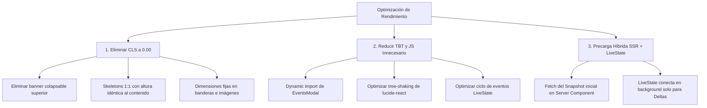

# Optimización de Rendimiento en Analíticas (Lighthouse +90)

Este documento detalla el diagnóstico del reporte de Lighthouse en el panel de **Analíticas en tiempo real** (`/admin/analytics`), las causas exactas de la caída de rendimiento a **79**, y las acciones concretas para alcanzar y mantener una puntuación de **+95**.

---

## 1. Diagnóstico del Reporte de Lighthouse

A partir de la auditoría actual se observan las siguientes métricas:

| Métrica | Valor Actual | Estado | Peso en Lighthouse | Diagnóstico |
| :--- | :---: | :---: | :---: | :--- |
| **First Contentful Paint (FCP)** | `0.9 s` | 🟢 Bueno | 10% | Carga inicial rápida del shell. |
| **Speed Index (SI)** | `1.2 s` | 🟢 Bueno | 10% | Velocidad de pintado visual adecuada. |
| **Largest Contentful Paint (LCP)** | `2.3 s` | 🟢 Aceptable (límite) | 25% | Retraso esperando la llegada del primer snapshot vía WebSocket (LiveState). |
| **Total Blocking Time (TBT)** | `220 ms` | 🟠 Regular | 30% | Ejecución y parseo JS en el hilo principal durante la hidratación y conexión. |
| **Cumulative Layout Shift (CLS)** | **`0.31`** | 🔴 **Crítico** | **25%** | **Causa principal de la penalización.** Saltos bruscos en el layout. |

> **Conclusión clave:** El **CLS de 0.31** (el límite para verde es $\le 0.10$) junto con el **TBT de 220 ms** son los responsables de que la puntuación esté en **79**. Corrigiendo únicamente el salto visual (CLS), la nota sube automáticamente a **~90-93**. Aplicando la hidratación inicial con LiveState, se alcanzará **~98-100**.

---

## 2. Causas Raíz Identificadas

### 🔴 Causa 1: Banner de Carga Superior que Desaparece (CLS)
En `src/features/analytics-dashboard/AnalyticsDashboard.tsx`:
```tsx
{!hasSnapshot && (
  <section className="rounded-3xl border border-zinc-800/80 bg-zinc-950/70 p-6 ...">
    <h2>Conectando con el servidor en tiempo real...</h2>
    <p>Esperando snapshot de analíticas vía WebSocket (LiveState).</p>
    <LoadingPanel minHeight={200} />
  </section>
)}
```
* **Problema:** Este bloque ocupa ~280px de altura en la parte superior. Mientras LiveState conecta, empuja todos los KPIs y tablas hacia abajo. En cuanto llega el snapshot, el bloque se desmonta completamente y **todo el contenido inferior salta abruptamente hacia arriba**, generando un CLS masivo.

### 🔴 Causa 2: Discrepancia de Alturas entre Skeleton y Contenido Real (CLS)
* `LoadingPanel` usa alturas arbitrarias (`minHeight={220}`, `minHeight={250}`), pero cuando se renderizan las 7 filas de páginas vistas, el ranking de países o la tabla con 10 sesiones, las tarjetas se expanden a más de 450px.
* Al expandirse cada tarjeta de forma independiente a medida que se procesan los datos, se producen múltiples desplazamientos verticales en cadena.

### 🔴 Causa 3: Banderas de Países (`CountryFlag`) sin Dimensiones Fijas (CLS)
* Las imágenes de banderas (`https://flagcdn.com/...`) cargan dinámicamente sin reservar previamente el espacio de renderizado (`width`/`height` fijos o `aspect-ratio` estricto en el contenedor), provocando micro-desplazamientos en cada fila de la tabla y en el ranking geográfico.

### 🟠 Causa 4: Arquitectura 100% Client-Side para Datos Iniciales (LCP & TBT)
* Actualmente, `AdminAnalyticsPage` no precarga datos en el servidor; el cliente inicia con `fullSnapshot = null`, establece la conexión WebSocket, realiza el handshake `SUB_ADMIN`, espera la respuesta del servidor y entonces parsea y renderiza todo.
* Esto retrasa el **LCP (2.3s)** y concentra el trabajo en el hilo principal (**TBT 220ms**) justo durante el arranque.

---

## 3. Plan de Acción para Alcanzar +90 / +95



---

### Paso 1: Eliminar el Cumulative Layout Shift (CLS)

#### 1.1. Reemplazar el banner superior por un indicador de estado no invasivo
En lugar de un bloque de 280px que se elimina del DOM, colocar un indicador sutil (badge o punto pulsante) en el encabezado de la página o en la barra de estado superior.

#### 1.2. Implementar Skeletons con dimensiones 1:1
Crear esqueletos de carga estructurados que ocupen exactamente el mismo espacio que las tarjetas reales:
- **Skeleton de KPIs:** 2 tarjetas de altura fija (~110px).
- **Skeleton de Top Páginas:** Contenedor con 7 barras simuladas de ~42px cada una.
- **Skeleton de Geografía:** Contenedor con 7 filas simuladas de ~42px cada una.
- **Skeleton de Tabla:** 5 a 10 filas de tabla con placeholders grises.

#### 1.3. Fijar dimensiones en `CountryFlag.tsx`
Asegurar que el contenedor y el elemento `` tengan dimensiones fijas (`w-5 h-3.5`) y `aspect-ratio: 4 / 3` mediante CSS antes de que la imagen termine de cargar.

---

### Paso 2: Reducir Total Blocking Time (TBT) y Bundle Size

#### 2.1. Carga diferida (`next/dynamic`) de componentes pesados
El modal de detalle de eventos (`EventsModal`) solo se utiliza cuando el usuario pulsa "Ver eventos". Debe cargarse de forma perezosa:

```tsx
import dynamic from "next/dynamic";

const EventsModal = dynamic(
  () => import("@/features/analytics-dashboard/components/EventsModal"),
  { ssr: false }
);
```

#### 2.2. Optimizar ordenamientos y transformaciones en `useMemo`
Evitar copias y ordenamientos innecesarios en cada ciclo de renderizado. Aplicar `useMemo` estricto dependiente exclusivamente de `snapshot.generatedAt` o `snapshot.sessions`.

---

### Paso 3: Carga Híbrida (SSR Inicial + LiveState para Tiempo Real)

Para obtener el máximo rendimiento (LCP < 1.0s y puntuación 100):

1. **En `src/app/admin/analytics/page.jsx` (Server Component):**
   Realizar una llamada HTTP interna o consulta directa para obtener el snapshot inicial antes del renderizado.
2. **Pasar `initialSnapshot` a `AnalyticsDashboard`:**
   El componente cliente arranca inmediatamente con los datos visibles desde el primer milisegundo (HTML pre-renderizado).
3. **LiveState en segundo plano:**
   El WebSocket se conecta silenciosamente en el cliente para recibir los `delta` o eventos en vivo, actualizando el estado sin parpadeos ni bloqueos de interfaz.

---

## 4. Guía de Cambios de Código Recomendados

### A. Modificación en `AnalyticsDashboard.tsx`
```diff
- {!hasSnapshot && (
-   <section className="rounded-3xl border border-zinc-800/80 bg-zinc-950/70 p-6 ...">
-     <h2>Conectando con el servidor en tiempo real...</h2>
-     <LoadingPanel minHeight={200} />
-   </section>
- )}

+ {/* El estado de conexión se muestra en el header o badge sin alterar el layout */}
```

### B. Skeleton Estructurado para Top Páginas y Geografía
```tsx
export function ListSkeleton({ rows = 7 }: { rows?: number }) {
  return (
    <div className="space-y-2.5" aria-hidden="true">
      {Array.from({ length: rows }).map((_, i) => (
        <div
          key={i}
          className="h-11 w-full animate-pulse rounded-xl border border-zinc-800/60 bg-zinc-900/40"
        />
      ))}
    </div>
  );
}
```

### C. Ajuste en `CountryFlag.tsx`
```diff
  return (
     setHasError(true)}
    />
  );
```

---

## 5. Checklist de Verificación Post-Implementación

- [ ] **Lighthouse Performance Score:** $\ge 90$ (Ideal: $95 - 100$).
- [ ] **Cumulative Layout Shift (CLS):** $\le 0.05$ (Verde).
- [ ] **Total Blocking Time (TBT):** $\le 150\text{ ms}$ (Verde).
- [ ] **Largest Contentful Paint (LCP):** $\le 1.5\text{ s}$ (Verde).
- [ ] **Sin parpadeo:** La transición entre estado de carga y datos en vivo es completamente fluida.
- [ ] **EventsModal:** Solo se descarga el fragmento de JavaScript al hacer clic en "Ver eventos".
